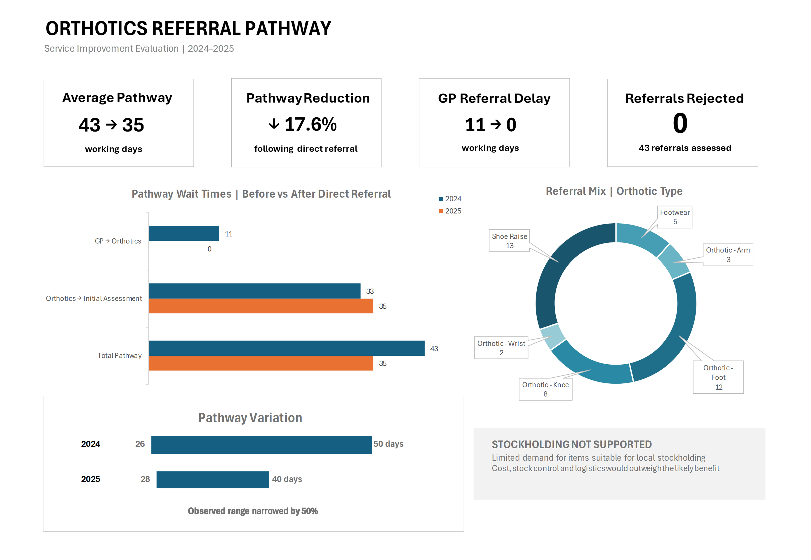

# Orthotics Referral Pathway – Excel Service Improvement Analysis

## Project Overview

This project evaluates a healthcare orthotics referral pathway before and after the introduction of a direct-referral model.

Historically, Community Rehabilitation Team (CRT) clinicians referred patients to Orthotics indirectly through their GP. The project examined whether this additional handoff contributed to pathway delays and whether direct referral could improve efficiency without increasing inappropriate referrals.

The analysis also explored referral demand and whether holding commonly requested orthotic products within the community service would be practical.

> **Portfolio note:** This is an anonymised portfolio adaptation of a healthcare service-improvement project. Patient and staff identifiers have been removed or replaced, and some data has been synthetically adapted. No patient-identifiable information is included.

---

## Dashboard

---

## Project Files

- [Download the Excel workbook](Orthotics_pathway_portfolio_git_hub.xlsx) – cleaned data, reference tables, exploratory analysis, validation and final dashboard
- [View the full evaluation report](Orthotics_Referral_Pathway_Evaluation_Portfolio_Report.docx) – project context, methodology, findings and recommendations
- [View the dashboard](orthotics-dashboard.png) – final Excel dashboard

---

## Business Questions

The analysis aimed to answer:

- How long did patients spend in the referral pathway?
- How much delay occurred between CRT referral and receipt by Orthotics?
- Did removing the GP referral stage reduce overall pathway time?
- Did downstream Orthotics waiting times also improve?
- Did direct referral result in inappropriate or rejected referrals?
- Was referral demand sufficient to justify local stockholding?

---

## Tools & Techniques

**Microsoft Excel**

- Data cleaning and standardisation
- Reference tables and `VLOOKUP`
- `TRIM`, `CLEAN` and `PROPER`
- `NETWORKDAYS`
- Data validation
- Duplicate checking
- PivotTables
- Descriptive statistics
- Before-and-after analysis
- Data visualisation
- Dashboard development

The workbook is structured to show the analytical workflow:

**Data Cleaning → Reference Tables → Initial Analysis → Deeper Analysis & Validation → Dashboard**

---

## Key Findings

| Measure | 2024 | 2025 |
|---|---:|---:|
| Referrals | 20 | 23 |
| Average total pathway | 42.5 days | 35 days |
| GP → Orthotics delay | 10.6 days | 0 days |
| Orthotics → Initial Assessment | 33 days | 35 days |
| Observed pathway range | 26–50 days | 28–40 days |
| Rejected referrals | 0 | 0 |

### 17.6% reduction in average pathway time

Average total pathway time reduced from **42.5 to 35 working days** following introduction of direct referral.

The GP referral stage had previously contributed an average **10.6 working days** and was eliminated under the new pathway.

Importantly, the downstream Orthotics-to-assessment interval did **not** improve, increasing slightly from **33 to 35 working days**. This suggests the observed reduction in overall pathway time was associated with removing the GP handoff rather than improvement in downstream waiting times.

The observed pathway range also narrowed from **26–50 to 28–40 working days**.

No referrals were rejected in either dataset.

---

## Stockholding Analysis

Referral demand was also reviewed to determine whether commonly requested orthotic products should be held locally by the community rehabilitation service.

Although some products could potentially be stocked, eligible demand was limited. When considered alongside purchasing costs, stock control, replenishment and logistics, the analysis did not support introducing local stockholding.

---

## Recommendations

- Continue the direct-referral pathway.
- Continue monitoring overall and downstream waiting times.
- Maintain standardised referral documentation and data recording.
- Do not introduce local orthotics stockholding based on current demand.
- Continue reviewing referral activity as additional data becomes available.

---

## Limitations

This was a small service-level evaluation involving **20 referrals in 2024 and 23 in 2025**.

The results are descriptive and show an observed association between introduction of direct referral and shorter overall pathway time; they do not provide formal causal proof.

Clinical outcomes following orthotic provision and full financial modelling were outside the scope of the analysis.

---

## Skills Demonstrated

`Excel` `Data Cleaning` `PivotTables` `VLOOKUP` `NETWORKDAYS` `Data Validation` `Descriptive Analysis` `Dashboard Design` `Healthcare Analytics` `Service Improvement`
